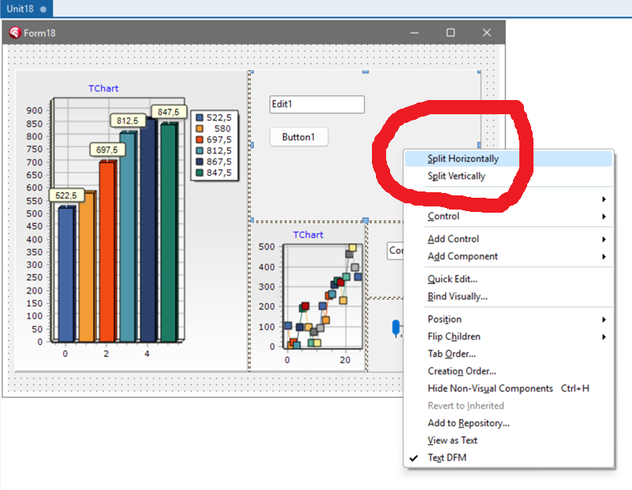

# Delphi-Split-Panel
Design-time menu options to split a TPanel into two child panels, horizontally or vertically

## Install:

- Open the Split_Panel project in RAD Studio
- Right-click at project explorer and click: "Install"

The package will be compiled and installed.

- Drop a TPanel into a VCL TForm
- Right-click the Panel1 and click "Split Horizontally" or "Split Vertically"
  
### Can be used to quickly design a multiple-zones Form, where each children panel is a control

TSplitter controls are optional, just delete them if you don't need them.

https://github.com/user-attachments/assets/3c20ed9d-da36-48d6-92ad-3e7dc090ffa9

### Click any panel and drop your controls, as usual.

For example:

